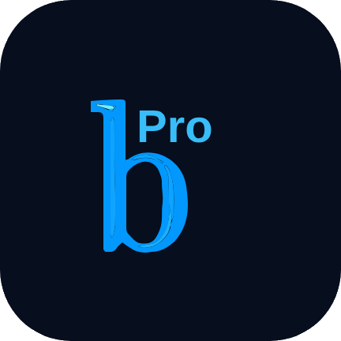

<p align="center">
  
</p>

<h1 align="center">Baresip Pro Max</h1>

<p align="center">
  <b>Modern, Private & High-Definition SIP Voice & Video Calling for Android</b>
</p>

<p align="center">
  <a href="https://github.com/Amin4424/baresip-studio/releases/latest">
    
  </a>
  
  
  
  
</p>

---

## 📱 About Baresip Pro Max

**Baresip Pro Max** is a powerful, privacy-first SIP (Session Initiation Protocol) client designed from the ground up for modern Android devices. Combining a state-of-the-art C/C++ real-time communications engine with a clean, fluid **Jetpack Compose (Material 3)** user interface, Baresip Pro Max delivers carrier-grade audio, crystal-clear high-definition video calling, and airtight end-to-end security.

Whether connecting to enterprise PBXs (such as Asterisk, FreePBX, Kamailio, OpenSIPS) or standard SIP providers, Baresip Pro Max gives you full control over your communications without proprietary lock-in, tracking, or telemetry.

---

## ✨ Key Features

### 🎥 Next-Generation Video Calling
- **Cutting-Edge Codecs**: Native support for **AV1**, **H.265 (HEVC)**, **H.264**, **VP8**, and **VP9** video codecs.
- **Hardware Acceleration**: Smooth real-time video encoding and decoding powered by Android MediaCodec and FFmpeg.
- **Camera2 Integration**: Seamless front and rear camera switching, live preview, and adaptive aspect ratio scaling.

### 🎙️ Crystal-Clear HD Audio
- **Wideband & Fullband Codecs**: Powered by **Opus**, **AMR-WB**, **AMR-NB**, **G.722**, **G.722.1**, **G.729**, **iLBC**, **Codec2**, and standard **G.711 (PCMA/PCMU)**.
- **Low-Latency Audio**: Optimized for Android AAudio and OpenSL ES sound systems to eliminate delay and jitter.

### 🔒 Privacy & Military-Grade Security
- **End-to-End Media Encryption**: Full support for **ZRTP** and **SRTP** (SDES and DTLS-SRTP).
- **Secure Signaling**: Encrypted SIP transport using **TLS**.
- **Zero Tracking**: 100% open-source, no analytical trackers, and no third-party data collection.

### 🎨 Modern Material 3 Design
- **Intuitive Navigation**: Redesigned bottom navigation bar for quick one-handed access to Keypad, Calls, Contacts, and Messages.
- **Modular Call Screen**: Dedicated, modern interfaces for incoming calls, outgoing calls, active calls, and hold states.
- **Built-in Call Recording**: Record critical conversations locally with high-fidelity playback.
- **Multi-Account Support**: Configure and switch between multiple SIP accounts simultaneously with live registration status indicators.
- **Messaging & History**: Full support for SIP instant messaging, contact synchronization, and detailed call logs.

---

## 📸 Screenshots

<p align="center">
  
  &nbsp;&nbsp;
  
  &nbsp;&nbsp;
  
  &nbsp;&nbsp;
  
</p>

---

## 📥 Download & Installation

You can download the latest ready-to-install signed APK directly from GitHub:

1. Go to the [**Releases Page**](https://github.com/Amin4424/baresip-studio/releases).
2. Download the latest `baresip-plus-*-release.apk`.
3. Open the downloaded file on your Android device and confirm installation.

> **System Requirements**: Android 9.0 (Pie / API level 28) or higher. Device support for Camera2 API (LIMITED or higher) is required for video calling.

---

## 🛠️ Building From Source

If you want to build the project yourself:

```bash
# Clone the repository with submodules
git clone --recurse-submodules https://github.com/Amin4424/baresip-studio.git
cd baresip-studio

# Assemble the release APK
./gradlew assembleRelease
```

Or build inside an isolated container with Docker:

```bash
docker compose -f docker/docker-compose.yml run --rm build-release
```

---

## 📄 License & Credits

- **License**: Distributed under the [GNU General Public License v3.0 (GPL-3.0)](LICENSE).
- **Core Engine**: Based on the [baresip](https://github.com/baresip/baresip) project by Alfred E. Heggestad and [baresip-studio](https://github.com/juha-h/baresip-studio) by Juha Heinanen.
- **Maintained by**: [Amin4424](https://github.com/Amin4424).
