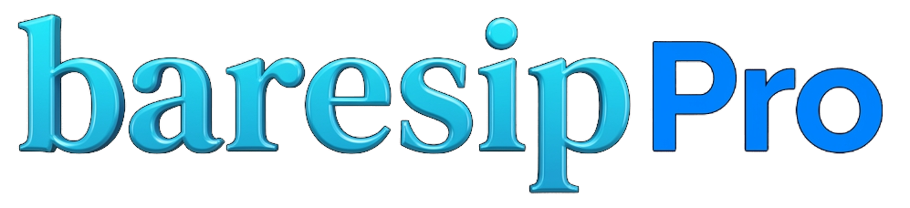

  

<h1 align="center">Baresip Pro</h1>

  <b>Modern, Private & High-Definition SIP Voice Softphone for Android</b>

  
  
  
  

---

## 📱 About Baresip Pro

**Baresip Pro** is a modern, privacy-first SIP (Session Initiation Protocol) client designed specifically for lightweight, high-performance voice communications on Android. It pairs the battle-tested, standard-compliant Baresip C audio engine with a completely reimagined, fluid **Jetpack Compose (Material 3)** interface.

* **Looking for Video Calling?** Check out our sister project **Baresip Pro Max** (on the `video-ui-modern` branch), which includes complete AV1/H.265/H.264 video streaming and Camera2 support.

---

## 💡 Why Baresip Pro? (Fork Philosophy)

**Baresip Pro** is an independent fork of [baresip-studio](https://github.com/juha-h/baresip-studio) by Juha Heinanen.

* **🎯 Completely Modernized UI**: Fluid **Jetpack Compose** interface following Material 3 design guidelines. Offers one-handed bottom navigation, an ergonomic keypad dialer, modular call screens, smooth animations, and automatic dark/light theme switching.
* **🎙️ Pure Voice-Only Focus**: Stripped of heavy video dependencies (no FFmpeg, x264, or VPX bloat), Baresip Pro delivers an ultra-compact APK size, lightning-fast startup, and minimal memory footprint.
* **⚡ Trusted Core Engine**: Powered by `libbaresip`, `libre`, and OpenSSL. All media handling, ZRTP/SRTP encryption, and network transports execute directly in optimized native C code.
* **🔒 Strict Privacy**: Zero trackers, no third-party telemetry, and no dependency on Google Cloud Messaging (GCM/FCM).

---

## ✨ Key Features

### 🎙️ Crystal-Clear HD Audio
- **Wideband & Fullband Codecs**: Support for **Opus**, **AMR-WB**, **AMR-NB**, **G.722**, **G.722.1**, **G.729**, **iLBC**, **Codec2**, and standard **G.711 (PCMA/PCMU)**.
- **Low-Latency Audio**: Optimized for Android AAudio and OpenSL ES sound systems to minimize delay and packet jitter.

### 🔒 Privacy & Military-Grade Security
- **End-to-End Media Encryption**: Full support for **ZRTP** and **SRTP** (SDES and DTLS-SRTP).
- **Secure Signaling**: Encrypted SIP transport using **TLS** and **WSS**.
- **Zero Tracking**: 100% open-source, no analytical trackers, and no third-party data collection.

### 🎨 Modern Material 3 Design
- **Intuitive Navigation**: Floating pill-shaped bottom navigation bar for quick access to Keypad, Calls, Contacts, and Messages.
- **Modular Call Screen**: Dedicated interface for incoming, outgoing, active, and hold states with audio gain controls and call recording.
- **Multi-Account Support**: Manage multiple SIP accounts simultaneously with live registration status indicators.
- **Call Recording**: Built-in high-fidelity local call recording.
- **Messaging & History**: Support for SIP instant messaging, contact synchronization, and call logs.

---

## 📸 Screenshots

  
  &nbsp;
  
  &nbsp;
  
  &nbsp;
  

---

## 📄 License

Distributed under the BSD-3-Clause License. See [LICENSE](LICENSE) for details.
