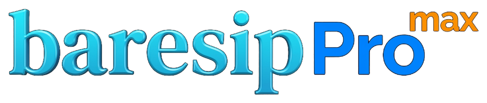
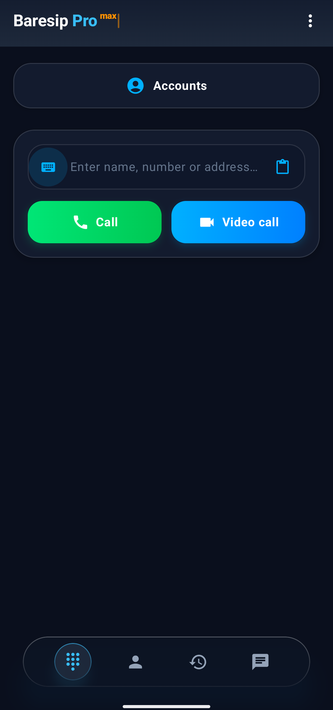
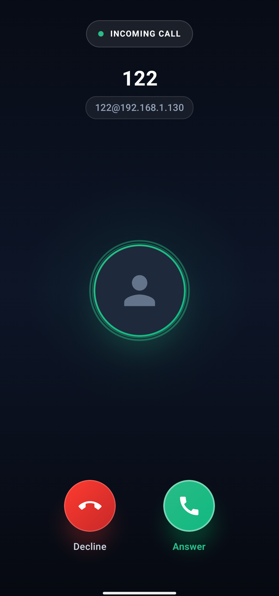
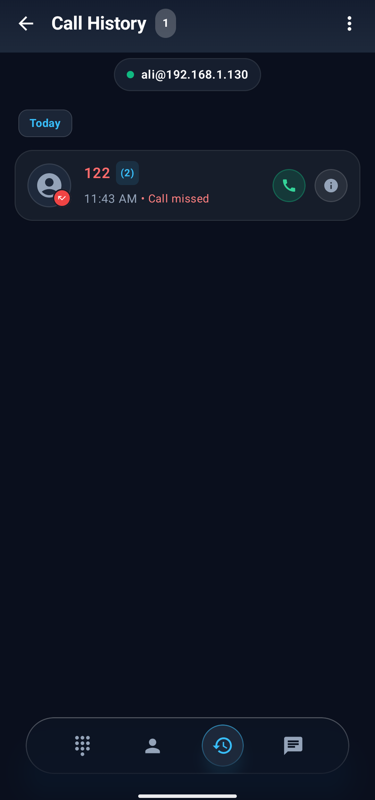
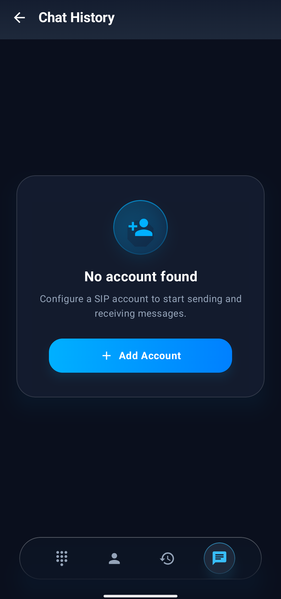

  

<h1 align="center">Baresip Pro Max</h1>

  <b>Modern, Private & High-Definition SIP Voice & Video Calling for Android</b>

  
  
  
  
  
  

---

## 📱 About Baresip Pro Max

**Baresip Pro Max** is a modern, privacy-first SIP (Session Initiation Protocol) client designed from the ground up for modern Android devices. It combines the rock-solid, industry-standard Baresip C/C++ real-time communications engine with a completely reimagined, fluid **Jetpack Compose (Material 3)** user interface.

Whether connecting to enterprise PBXs (such as Asterisk, FreePBX, Kamailio, OpenSIPS) or standard SIP providers, Baresip Pro Max gives you full control over your communications without proprietary lock-in, tracking, or telemetry.

* **Looking for a Voice-Only Client?** Check out our lightweight sister edition **Baresip Pro** (on the `master` branch), stripped of video dependencies for a minimal APK size and ultra-fast startup.

---

## 💡 Why Baresip Pro Max? (Fork Philosophy)

**Baresip Pro Max** is a friendly, independent fork of the well-known [Baresip+](https://github.com/juha-h/baresip-studio) by Juha Heinanen.

* **🎯 Completely Re-engineered UI**: The legacy XML views and layouts have been replaced with a fluid, modern **Jetpack Compose** interface following Material 3 design principles. This brings one-handed navigation, an ergonomic dialer, modern call screens, high-definition video previews, and seamless dark/light theme transitions.
* **⚡ Battle-Tested Core Engine**: We do not reinvent the wheel on SIP signaling or RTP media. The underlying engine remains 100% faithful to **Baresip** (`libre`, `librem`, `libbaresip`, and OpenSSL). All media codecs, ZRTP/SRTP encryption, and network transports run on the trusted native C stack.
* **🔄 Seamless Upstream Synchronization**: Because the modern UI layer is decoupled from the background service (`BaresipService.kt`) and native C core, upstream bugfixes, security advisories, and protocol updates can easily be merged while preserving the modern UI experience.

---

## ✨ Key Features

### 🎥 Next-Generation Video Calling
- **Cutting-Edge Codecs**: Native support for **AV1**, **H.265 (HEVC)**, **H.264**, **VP8**, and **VP9** video codecs.
- **Hardware Acceleration**: Smooth real-time video encoding and decoding powered by Android MediaCodec and FFmpeg.
- **Camera2 Integration**: Seamless front and rear camera switching, live preview, and adaptive aspect ratio scaling.

### 🎙️ Crystal-Clear HD Audio
- **Wideband & Fullband Codecs**: Powered by **Opus**, **AMR-WB**, **AMR-NB**, **G.722**, **G.722.1**, **G.729**, **iLBC**, **Codec2**, and standard **G.711 (PCMA/PCMU)**.
- **Low-Latency Audio**: Optimized for Android AAudio and OpenSL ES sound systems to eliminate delay and jitter.

### 🔒 Privacy & Military-Grade Security
- **End-to-End Media Encryption**: Full support for **ZRTP** and **SRTP** (SDES and DTLS-SRTP).
- **Secure Signaling**: Encrypted SIP transport using **TLS**.
- **Zero Tracking**: 100% open-source, no analytical trackers, and no third-party data collection.

### 🎨 Modern Material 3 Design
- **Intuitive Navigation**: Redesigned bottom navigation bar for quick one-handed access to Keypad, Calls, Contacts, and Messages.
- **Modular Call Screen**: Dedicated, modern interfaces for incoming calls, outgoing calls, active calls, and hold states.
- **Built-in Call Recording**: Record critical conversations locally with high-fidelity playback.
- **Multi-Account Support**: Configure and switch between multiple SIP accounts simultaneously with live registration status indicators.
- **Messaging & History**: Full support for SIP instant messaging, contact synchronization, and detailed call logs.

---

## 📸 Screenshots

  
  &nbsp;
  
  &nbsp;
  
  &nbsp;
  

---

## 📥 Download & Installation

You can download the latest ready-to-install signed APKs directly from GitHub [**Releases**](https://github.com/Amin4424/baresip-pro-max/releases):

| APK Variant | Target Devices | Size | Notes |
| :--- | :--- | :--- | :--- |
| **`*-arm64-v8a.apk`** | Modern Android Phones & Tablets | **Smallest (~30MB)** | 🌟 **Recommended** for 99% of physical Android devices |
| **`*-universal.apk`** | Any Android Device | Standard | **Global release** — contains all architectures in one package |
| **`*-x86_64.apk`** | Android Studio Emulator / PC / ChromeOS | **Smallest (~30MB)** | Tailored for 64-bit x86 Intel & AMD systems |

> **System Requirements**: Android 9.0 (Pie / API level 28) or higher. Device support for Camera2 API (LIMITED or higher) is required for video calling.

---

## 📄 License & Credits

- **License**: Distributed under the [BSD 3-Clause License](LICENSE).
- **Original Baresip Project**: Developed by Alfred E. Heggestad and the [Creytiv Baresip community](https://github.com/baresip/baresip).
- **Upstream Baresip+**: Authored by Juha Heinanen / [TutPro Inc.](https://github.com/juha-h/baresip-studio).
- **Baresip Pro Max**: Modern Jetpack Compose UI, video enhancements, and packaging maintained by [Amin4424](https://github.com/Amin4424).
